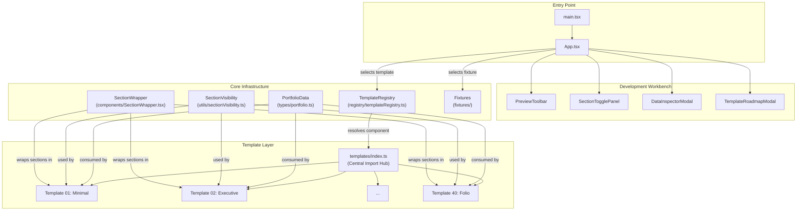
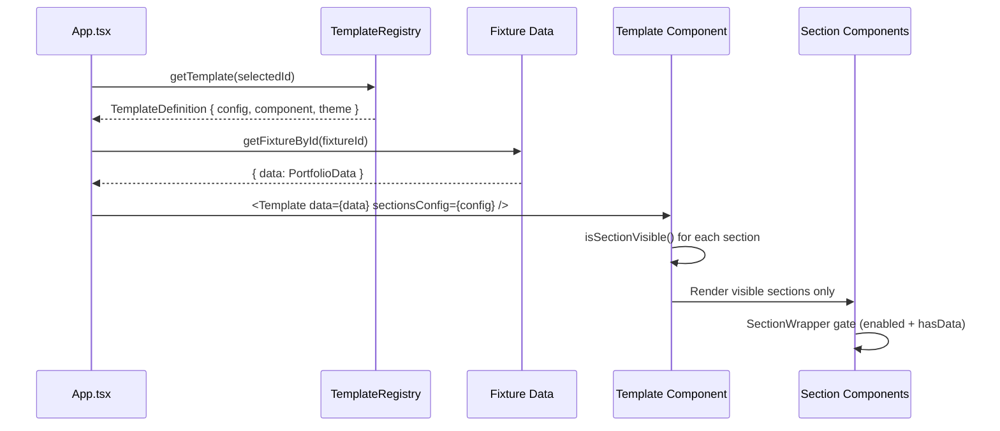
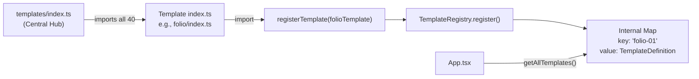
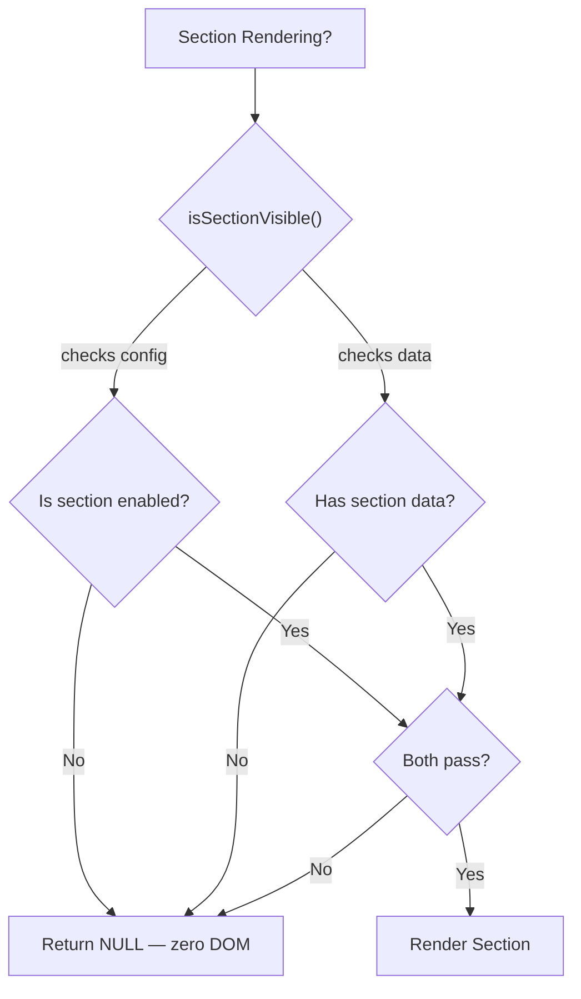
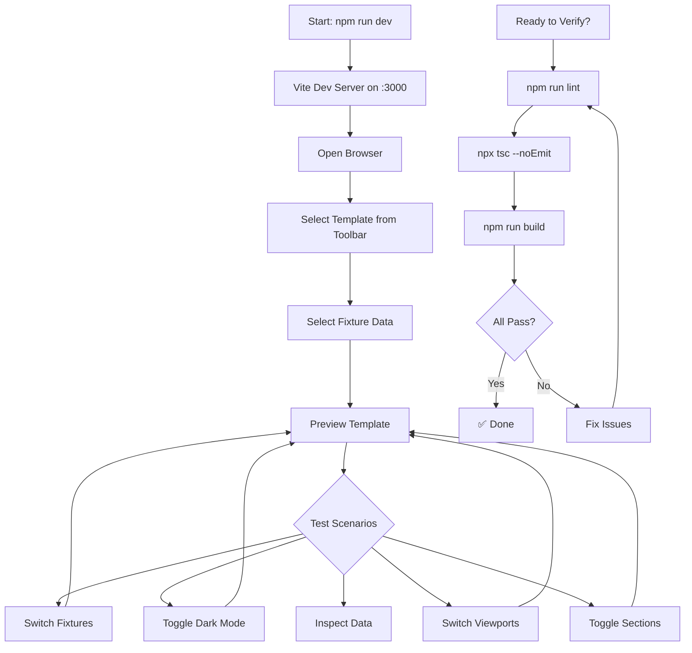
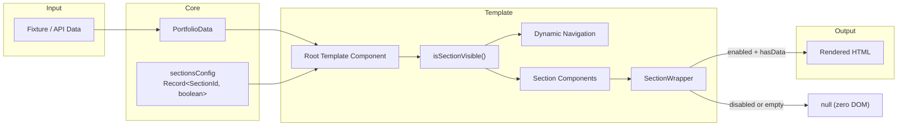

# Universal Portfolio Template System

## Architecture, Structure & Workflow Documentation

---

## Table of Contents

1. [Project Overview](#1-project-overview)
2. [Technology Stack](#2-technology-stack)
3. [Directory Structure](#3-directory-structure)
4. [Architecture Diagram](#4-architecture-diagram)
5. [Core Data Contract](#5-core-data-contract)
6. [Template System Architecture](#6-template-system-architecture)
7. [Template Registry & Registration](#7-template-registry--registration)
8. [Template Anatomy — File Structure](#8-template-anatomy--file-structure)
9. [Section Visibility System](#9-section-visibility-system)
10. [Theme System](#10-theme-system)
11. [Shared Core Components](#11-shared-core-components)
12. [Development Workbench (App Shell)](#12-development-workbench-app-shell)
13. [Fixture System (Sample Data)](#13-fixture-system-sample-data)
14. [Template Catalog — All 40 Templates](#14-template-catalog--all-40-templates)
15. [Development Workflow](#15-development-workflow)
16. [Adding a New Template — Step-by-Step](#16-adding-a-new-template--step-by-step)
17. [Data Flow Diagram](#17-data-flow-diagram)
18. [Coding Rules & Constraints](#18-coding-rules--constraints)
19. [Build, Lint & Verification Commands](#19-build-lint--verification-commands)
20. [Responsive Design Strategy](#20-responsive-design-strategy)
21. [Accessibility Requirements](#21-accessibility-requirements)
22. [Performance Considerations](#22-performance-considerations)

---

## 1. Project Overview

The **Universal Portfolio Template System** is a React-based application containing **40 unique, production-quality portfolio templates**. Each template consumes a single canonical data contract (`PortfolioData`) and renders a visually distinct, fully responsive, dark-mode-enabled portfolio website.

**Key Principles:**
- **One Data Schema, Many Visual Languages** — Every template renders the same `PortfolioData` shape
- **Template Isolation** — Each template is a self-contained module with zero cross-template dependencies
- **Zero DOM Footprint** — Disabled or empty sections produce no HTML output whatsoever
- **Canonical Data Only** — No template fabricates, invents, or hardcodes portfolio content
- **Dynamic Navigation** — Navigation derives from visible sections, not hardcoded lists

---

## 2. Technology Stack

| Layer | Technology | Version |
|-------|-----------|---------|
| **Framework** | React | 19.x |
| **Language** | TypeScript | 5.8.x |
| **Build Tool** | Vite | 6.x |
| **Styling** | TailwindCSS | 4.x |
| **Animations** | Motion (Framer Motion) | 12.x |
| **Icons** | Lucide React | 0.546.x |
| **Type Checking** | `tsc --noEmit` | Via `npm run lint` |

### Scripts

```json
{
  "dev": "vite --port=3000 --host=0.0.0.0",
  "build": "vite build",
  "preview": "vite preview",
  "lint": "tsc --noEmit"
}
```

---

## 3. Directory Structure

```
30-Templets-for-Portfolio/
│
├── index.html                         # HTML entry point
├── package.json                       # Dependencies & scripts
├── tsconfig.json                      # TypeScript configuration
├── vite.config.ts                     # Vite build configuration
│
├── public/                            # Static assets
│
├── src/
│   ├── main.tsx                       # React DOM entry — mounts <App />
│   ├── App.tsx                        # Development workbench (template selector + preview)
│   ├── index.css                      # Global CSS & Tailwind imports
│   │
│   ├── components/                    # App-level UI (dev workbench tools)
│   │   ├── PreviewToolbar.tsx         # Template/fixture/viewport selector bar
│   │   ├── SectionTogglePanel.tsx     # Section enable/disable modal
│   │   ├── DataInspectorModal.tsx     # Raw JSON data inspector
│   │   ├── TemplateRoadmapModal.tsx   # Template roadmap/progress viewer
│   │   └── EmptyTemplateLab.tsx       # Empty state when no template selected
│   │
│   ├── core/                          # Shared infrastructure
│   │   ├── types/                     # TypeScript type contracts
│   │   │   ├── portfolio.ts           # ★ Canonical PortfolioData schema
│   │   │   ├── template.ts            # TemplateConfig, TemplateProps, TemplateDefinition
│   │   │   ├── theme.ts              # ThemeTokens, ThemeColors, ThemeOverride
│   │   │   ├── section.ts            # SectionId, SectionConfig, SectionMeta
│   │   │   └── index.ts              # Re-exports
│   │   │
│   │   ├── components/               # Shared reusable components
│   │   │   ├── SectionWrapper.tsx     # ★ Zero-DOM-footprint section gate
│   │   │   ├── ImageWithFallback.tsx  # Graceful image loading with fallback
│   │   │   ├── ProjectDetailModal.tsx # Shared project detail modal
│   │   │   ├── ResumeButton.tsx       # Resume download button
│   │   │   ├── SocialLinks.tsx        # Social platform links renderer
│   │   │   └── index.ts              # Re-exports
│   │   │
│   │   ├── utils/                     # Shared utilities
│   │   │   ├── sectionVisibility.ts   # ★ isSectionVisible(), hasSectionData()
│   │   │   ├── cn.ts                  # Class name merge utility (clsx + twMerge)
│   │   │   ├── formatters.ts          # Date/text formatting helpers
│   │   │   └── index.ts              # Re-exports
│   │   │
│   │   ├── registry/                  # Template registration system
│   │   │   └── templateRegistry.ts    # ★ TemplateRegistry class + helpers
│   │   │
│   │   └── fixtures/                  # Sample data for development/testing
│   │       ├── developer.ts           # Full-featured developer profile
│   │       ├── designer.ts            # Designer profile
│   │       ├── creative.ts            # Creative professional profile
│   │       ├── student.ts             # Student/entry-level profile
│   │       ├── legal.ts               # Legal professional profile
│   │       ├── sparse.ts              # Minimal data (profile-only)
│   │       └── index.ts              # Fixture registry + helpers
│   │
│   └── templates/                     # ★ All 40 template implementations
│       ├── index.ts                   # Central import hub — registers all templates
│       ├── minimal/                   # Template 01
│       ├── executive/                 # Template 02
│       ├── neural/                    # Template 03
│       ├── ...                        # Templates 04–39
│       └── folio/                     # Template 40
│           ├── index.ts               # Entry point — exports TemplateDefinition
│           ├── template.config.ts     # TemplateConfig (id, name, sections)
│           ├── theme.ts               # ThemeTokens (colors, typography, spacing)
│           ├── FolioTemplate.tsx       # Root component (assembles all sections)
│           ├── components/            # Template-specific visual primitives
│           │   ├── FolioSheet.tsx
│           │   ├── FolioNav.tsx
│           │   ├── FolioHeader.tsx
│           │   ├── FolioFooter.tsx
│           │   └── FolioMeta.tsx
│           └── sections/              # Template-specific section components
│               ├── FolioAboutSection.tsx
│               ├── FolioSkillsSection.tsx
│               ├── FolioWorkSection.tsx
│               ├── FolioExperienceSection.tsx
│               ├── FolioEducationSection.tsx
│               ├── FolioCertificationsSection.tsx
│               ├── FolioServicesSection.tsx
│               ├── FolioAchievementsSection.tsx
│               ├── FolioTestimonialsSection.tsx
│               ├── FolioConnectSection.tsx
│               └── FolioContactSection.tsx
```

---

## 4. Architecture Diagram



---

## 5. Core Data Contract

The **single source of truth** for all portfolio data. Every template consumes this exact interface — no exceptions.

**File:** `src/core/types/portfolio.ts`

### PortfolioData (Root)

```typescript
interface PortfolioData {
  profile: Profile;                    // ★ REQUIRED — the only mandatory field
  socials?: SocialLink[];              // Optional
  skills?: SkillGroup[];               // Optional
  projects?: Project[];                // Optional
  experience?: Experience[];           // Optional
  education?: Education[];             // Optional
  certifications?: Certification[];    // Optional
  achievements?: Achievement[];        // Optional
  services?: Service[];                // Optional
  testimonials?: Testimonial[];        // Optional
  contact?: ContactInfo;               // Optional
  meta?: { lastUpdated?; customDomain?; keywords? };
}
```

### Key Sub-Interfaces

| Interface | Required Fields | Optional Fields |
|-----------|----------------|-----------------|
| **Profile** | `name` | `headline`, `role`, `summary`, `bio`, `location`, `avatarUrl`, `bannerUrl`, `availableForHire`, `statusBadge`, `contactEmail`, `contactPhone`, `pronouns`, `resumeUrl` |
| **SkillGroup** | `category`, `skills` | `description` |
| **SkillItem** | `name` | `level`, `icon`, `yearsOfExperience` |
| **Project** | `id`, `title` | `subtitle`, `tagline`, `description`, `detailedMarkdown`, `role`, `client`, `year`, `startDate`, `endDate`, `category`, `tags`, `technologies`, `featured`, `thumbnailUrl`, `media`, `liveUrl`, `sourceUrl`, `caseStudyUrl`, `highlights`, `metrics` |
| **Experience** | `id`, `role`, `company`, `startDate` | `companyUrl`, `logoUrl`, `location`, `locationType`, `employmentType`, `endDate`, `current`, `description`, `highlights`, `technologies` |
| **Education** | `id`, `institution`, `degree` | `fieldOfStudy`, `location`, `logoUrl`, `institutionUrl`, `startDate`, `endDate`, `current`, `grade`, `description`, `activities`, `courses` |
| **Certification** | `id`, `name`, `issuer` | `issuerLogoUrl`, `issueDate`, `expiryDate`, `credentialId`, `credentialUrl`, `description` |
| **Achievement** | `id`, `title` | `issuer`, `date`, `description`, `url`, `category` |
| **Service** | `id`, `title`, `description` | `icon`, `deliverables`, `rate`, `timeline` |
| **Testimonial** | `id`, `author`, `quote` | `role`, `company`, `avatarUrl`, `relationship`, `url`, `rating` |
| **ContactInfo** | *(none)* | `email`, `phone`, `location`, `calendlyUrl`, `officeHours`, `preferredMethod`, `messagePrompt`, `address`, `customFields` |
| **SocialLink** | `platform`, `url` | `label`, `username` |

---

## 6. Template System Architecture

### How a Template Works



### TemplateDefinition Interface

Every template exports a `TemplateDefinition`:

```typescript
interface TemplateDefinition {
  config: TemplateConfig;        // Metadata (id, name, description, sections)
  component: TemplateComponent;  // The React component to render
  defaultTheme: ThemeTokens;     // Color palette, typography, spacing
}
```

### TemplateProps Interface

Every template component receives these props:

```typescript
interface TemplateProps {
  data: PortfolioData;                             // The portfolio data
  sectionsConfig: Record<SectionId, boolean>;       // Section enable/disable map
  themeOverride?: ThemeOverride;                    // Optional theme customization
  activeProjectModalId?: string | null;             // Currently open project modal
  onOpenProjectModal?: (projectId: string) => void; // Open project detail
  onCloseProjectModal?: () => void;                 // Close project detail
  isPreview?: boolean;                              // Whether in dev preview mode
}
```

---

## 7. Template Registry & Registration

**File:** `src/core/registry/templateRegistry.ts`

The registry is a singleton `Map<string, TemplateDefinition>` that serves as the single source of truth for all available templates at runtime.

### Registration Flow



### Registry API

| Function | Returns | Description |
|----------|---------|-------------|
| `registerTemplate(def)` | `void` | Registers a template in the global registry |
| `getTemplate(id)` | `TemplateDefinition \| undefined` | Retrieves template by ID |
| `getAllTemplates()` | `TemplateDefinition[]` | Returns all registered templates |
| `getTemplateIds()` | `string[]` | Returns all registered template IDs |
| `hasTemplate(id)` | `boolean` | Checks if a template exists |
| `templateRegistry.count` | `number` | Total count of registered templates |

### Central Import Hub

**File:** `src/templates/index.ts`

This file imports every template module, which triggers their side-effect registration via `registerTemplate()`. It also exports the `TEMPLATES` array for convenience.

```
templates/index.ts  →  imports folio/index.ts
                    →  folio/index.ts calls registerTemplate(folioTemplate)
                    →  Template is now available via getTemplate('folio-01')
```

---

## 8. Template Anatomy — File Structure

Every template follows a consistent internal structure:

```
src/templates/<template-name>/
│
├── index.ts                    # Entry point — creates TemplateDefinition, calls registerTemplate()
├── template.config.ts          # TemplateConfig metadata (id, name, description, sections)
├── theme.ts                    # ThemeTokens (colors, typography, spacing, shadows)
├── <Name>Template.tsx          # Root template component — assembles all sections
│
├── components/                 # Template-specific visual primitives
│   ├── <Name>Header.tsx        # Hero / profile header
│   ├── <Name>Nav.tsx           # Navigation component
│   ├── <Name>Footer.tsx        # Footer component
│   └── <Name><Primitive>.tsx   # Custom visual primitives (e.g., FolioSheet, ContourLines)
│
└── sections/                   # Section implementations
    ├── <Name>AboutSection.tsx
    ├── <Name>SkillsSection.tsx
    ├── <Name>WorkSection.tsx
    ├── <Name>ExperienceSection.tsx
    ├── <Name>EducationSection.tsx
    ├── <Name>CertificationsSection.tsx
    ├── <Name>ServicesSection.tsx
    ├── <Name>AchievementsSection.tsx
    ├── <Name>TestimonialsSection.tsx
    ├── <Name>ConnectSection.tsx
    └── <Name>ContactSection.tsx
```

### Typical File Responsibilities

| File | Purpose |
|------|---------|
| `index.ts` | Bundles config + theme + component into `TemplateDefinition`, calls `registerTemplate()` |
| `template.config.ts` | Declares the template ID, name, category, supported sections |
| `theme.ts` | Defines the color palette, fonts, spacing, shadows, border radii |
| `<Name>Template.tsx` | Root component — reads `sectionsConfig`, calls `isSectionVisible()`, conditionally renders sections, manages dynamic navigation and page numbering |
| `components/` | Visual primitives unique to this template's design language |
| `sections/` | Each section wraps content in `SectionWrapper` for zero-DOM-footprint compliance |

---

## 9. Section Visibility System

The section visibility system ensures that disabled or empty sections produce **zero DOM output** — no wrappers, no headings, no spacing, no decorative elements.

### Two-Layer Gate



### Layer 1: `isSectionVisible()` (Utility)

**File:** `src/core/utils/sectionVisibility.ts`

Used in the root template component to decide which sections to render and which navigation items to show:

```typescript
function isSectionVisible(
  sectionId: SectionId,
  config: Record<SectionId, boolean> | undefined,
  data?: PortfolioData | null
): boolean
```

### Layer 2: `SectionWrapper` (Component)

**File:** `src/core/components/SectionWrapper.tsx`

Wraps every section component. If `enabled` is false or `hasData` is false, returns `null`:

```tsx
<SectionWrapper id="skills" enabled={config.skills} hasData={hasData}>
  {/* Section content only renders if both gates pass */}
</SectionWrapper>
```

### Supported Section IDs

| Section ID | Data Source | Core? |
|------------|-----------|-------|
| `profile` | `data.profile` | ★ Yes (mandatory) |
| `about` | `data.profile.bio` or `data.profile.summary` | No |
| `skills` | `data.skills[]` | No |
| `work` | `data.projects[]` | No |
| `experience` | `data.experience[]` | No |
| `education` | `data.education[]` | No |
| `achievements` | `data.achievements[]` | No |
| `certifications` | `data.certifications[]` | No |
| `services` | `data.services[]` | No |
| `testimonials` | `data.testimonials[]` | No |
| `connect` | `data.socials[]` | No |
| `contact` | `data.contact` | No |

---

## 10. Theme System

**File:** `src/core/types/theme.ts`

Each template defines a `ThemeTokens` object specifying its complete visual identity.

### ThemeTokens Structure

```typescript
interface ThemeTokens {
  mode: 'light' | 'dark' | 'system';
  colors: ThemeColors;          // 15 semantic color tokens
  typography: ThemeTypography;  // Heading, body, mono fonts + scale ratio
  spacing: ThemeSpacing;        // Container padding, section spacing, element gaps
  radius: ThemeRadius;          // sm, md, lg, full border radii
  shadows: ThemeShadows;        // sm, md, lg box shadows
  animation: AnimationLevel;    // 'none' | 'subtle' | 'expressive'
  density: LayoutDensity;       // 'compact' | 'comfortable' | 'spacious'
}
```

### Color Tokens

| Token | Purpose |
|-------|---------|
| `background` | Page canvas color |
| `surface` | Card/sheet surface |
| `surfaceSubtle` | Subtle variation surface |
| `surfaceElevated` | Elevated component surface |
| `primary` | Primary brand color |
| `primaryForeground` | Text on primary |
| `primaryMuted` | Muted primary (backgrounds) |
| `accent` | Accent/highlight color |
| `accentForeground` | Text on accent |
| `textPrimary` | Main body text |
| `textSecondary` | Secondary/supporting text |
| `textMuted` | Muted/tertiary text |
| `border` | Default border color |
| `borderSubtle` | Subtle border color |
| `ring` | Focus ring color |

### Dark Mode

All templates support dark mode via Tailwind's `dark:` variant classes. Dark mode is toggled by adding/removing the `dark` class on `<html>`.

---

## 11. Shared Core Components

These components are shared across all 40 templates:

| Component | File | Purpose |
|-----------|------|---------|
| **SectionWrapper** | `core/components/SectionWrapper.tsx` | Enforces zero-DOM-footprint visibility rules |
| **ImageWithFallback** | `core/components/ImageWithFallback.tsx` | Graceful image loading with placeholder/error states |
| **ProjectDetailModal** | `core/components/ProjectDetailModal.tsx` | Shared modal for detailed project views (media gallery, description, links) |
| **ResumeButton** | `core/components/ResumeButton.tsx` | Consistent resume/CV download button |
| **SocialLinks** | `core/components/SocialLinks.tsx` | Social platform link renderer with icons |

### Shared Utilities

| Utility | File | Purpose |
|---------|------|---------|
| **cn()** | `core/utils/cn.ts` | Class name merge (clsx + Tailwind merge) |
| **isSectionVisible()** | `core/utils/sectionVisibility.ts` | Dual-gate section visibility check |
| **hasSectionData()** | `core/utils/sectionVisibility.ts` | Checks if data exists for a section |
| **getDefaultSectionsConfig()** | `core/utils/sectionVisibility.ts` | Returns all-enabled section config |
| **toSectionConfigs()** | `core/utils/sectionVisibility.ts` | Converts map to `SectionConfig[]` |
| **formatters** | `core/utils/formatters.ts` | Date and text formatting helpers |

---

## 12. Development Workbench (App Shell)

**File:** `src/App.tsx`

The App shell is a **development-only workbench** for previewing and testing templates. It is NOT part of the final portfolio output.

### Workbench Features

| Feature | Component | Description |
|---------|-----------|-------------|
| **Template Selector** | `PreviewToolbar` | Dropdown to switch between all 40 templates |
| **Fixture Selector** | `PreviewToolbar` | Switch between sample data profiles |
| **Viewport Simulator** | `PreviewToolbar` | Preview at `full`, `desktop (1440px)`, `tablet (768px)`, `mobile (375px)`, `mobile-sm (320px)` |
| **Dark Mode Toggle** | `PreviewToolbar` | Toggle light/dark mode |
| **Section Manager** | `SectionTogglePanel` | Enable/disable individual sections |
| **Data Inspector** | `DataInspectorModal` | View raw JSON of current fixture |
| **Template Roadmap** | `TemplateRoadmapModal` | View all registered templates and their status |

---

## 13. Fixture System (Sample Data)

**Directory:** `src/core/fixtures/`

Fixtures provide realistic sample `PortfolioData` for testing templates during development.

| Fixture | File | Description |
|---------|------|-------------|
| **Developer** | `developer.ts` | Full-featured software developer profile (all sections populated) |
| **Designer** | `designer.ts` | UI/UX designer profile |
| **Creative** | `creative.ts` | Creative professional (photographer, artist) |
| **Student** | `student.ts` | Student/entry-level profile |
| **Legal** | `legal.ts` | Legal professional profile |
| **Sparse** | `sparse.ts` | Minimal data — profile only (tests sparse-data resilience) |

---

## 14. Template Catalog — All 40 Templates

| # | ID | Name | Visual Language |
|---|-----|------|----------------|
| 01 | `minimal-01` | **Minimal** | Clean, whitespace-driven minimalism |
| 02 | `executive-01` | **Executive** | Corporate, authoritative, structured |
| 03 | `neural-01` | **Neural** | Tech-forward, data-inspired neural networks |
| 04 | `cinema-01` | **Cinema** | Cinematic, wide-screen, dramatic |
| 05 | `canvas-01` | **Canvas** | Artist's canvas, creative workspace |
| 06 | `journey-01` | **Journey** | Narrative storytelling, chapter-based |
| 07 | `swiss-01` | **Swiss** | International Typographic Style, grid-rigid |
| 08 | `aurora-01` | **Aurora** | Gradient-rich, ethereal, luminous |
| 09 | `retro-01` | **Retro** | Nostalgic, vintage, pixel-influenced |
| 10 | `botanical-01` | **Botanical** | Nature-inspired, organic, botanical illustration |
| 11 | `brutalist-01` | **Brutalist** | Raw, confrontational, anti-design |
| 12 | `bento-01` | **Bento** | Grid-based bento box compartments |
| 13 | `editorial-01` | **Editorial** | Magazine/publication editorial layout |
| 14 | `magazine-noir-01` | **Magazine Noir** | Dark magazine editorial, high contrast |
| 15 | `neo-organic-01` | **Neo Organic** | Organic shapes, soft curves, biomorphic |
| 16 | `memphis-01` | **Memphis** | 1980s Memphis Group, bold patterns, playful |
| 17 | `collage-01` | **Collage** | Paper collage, layered cutouts, mixed media |
| 18 | `blueprint-01` | **Blueprint** | Technical blueprint/schematic drawing |
| 19 | `paperfold-01` | **Paperfold** | Folded paper, origami-inspired |
| 20 | `monochrome-01` | **Monochrome** | Single-color, high-contrast black & white |
| 21 | `orbital-01` | **Orbital** | Space/orbit-inspired, planetary |
| 22 | `duplex-01` | **Duplex** | Duotone, split-screen composition |
| 23 | `kinetic-01` | **Kinetic** | Motion-driven, dynamic animation |
| 24 | `mosaic-01` | **Mosaic** | Tile-based mosaic pattern composition |
| 25 | `archive-01` | **Archive** | Archival/catalog documentation style |
| 26 | `index-01` | **Index** | Index/directory listing, systematic |
| 27 | `terminal-01` | **Terminal** | CLI/terminal emulator aesthetic |
| 28 | `poster-01` | **Poster** | Large-format typographic poster |
| 29 | `blueprint-os-01` | **Blueprint OS** | Desktop OS window manager metaphor |
| 30 | `organic-flow-01` | **Organic Flow** | Flowing organic forms, liquid shapes |
| 31 | `monumental-01` | **Monumental** | Grand, monumental architecture scale |
| 32 | `prism-01` | **Prism** | Faceted geometry, optical refraction |
| 33 | `kinship-01` | **Kinship** | Relationship systems, connection networks |
| 34 | `tessera-01` | **Tessera** | Interlocking visual pieces, tessellation |
| 35 | `vellum-01` | **Vellum** | Annotated document, marginal notes |
| 36 | `chroma-01` | **Chroma** | Large controlled color fields, chromatic zones |
| 37 | `monoform-01` | **Monoform** | One continuous visual form, seamless surface |
| 38 | `chronicle-01` | **Chronicle** | Time-based horizontal strata, temporal layers |
| 39 | `contour-01` | **Contour** | Topographic contour lines, information landscape |
| 40 | `folio-01` | **Folio** | Layered professional portfolio sheets |

---

## 15. Development Workflow



---

## 16. Adding a New Template — Step-by-Step

### Step 1: Create Directory

```
src/templates/<template-name>/
├── index.ts
├── template.config.ts
├── theme.ts
├── <Name>Template.tsx
├── components/
│   ├── <Name>Header.tsx
│   ├── <Name>Nav.tsx
│   └── <Name>Footer.tsx
└── sections/
    ├── <Name>AboutSection.tsx
    ├── <Name>SkillsSection.tsx
    ├── <Name>WorkSection.tsx
    ├── <Name>ExperienceSection.tsx
    ├── <Name>EducationSection.tsx
    ├── <Name>CertificationsSection.tsx
    ├── <Name>ServicesSection.tsx
    ├── <Name>AchievementsSection.tsx
    ├── <Name>TestimonialsSection.tsx
    ├── <Name>ConnectSection.tsx
    └── <Name>ContactSection.tsx
```

### Step 2: Define Config (`template.config.ts`)

```typescript
import type { TemplateConfig } from '../../core/types/template';
import { getDefaultSectionsConfig, toSectionConfigs } from '../../core/utils/sectionVisibility';

export const myConfig: TemplateConfig = {
  id: 'my-template-01',
  name: 'My Template',
  description: 'A description of the visual language.',
  version: '1.0.0',
  category: 'creative',
  styles: ['modern', 'clean'],
  supportedDomains: ['designers', 'developers'],
  animationLevel: 'subtle',
  supportsDarkMode: true,
  sections: toSectionConfigs(getDefaultSectionsConfig()),
  tags: ['tag1', 'tag2'],
  author: 'System',
};
```

### Step 3: Define Theme (`theme.ts`)

Define light mode colors, typography (heading/body/mono fonts), spacing, radii, and shadows.

### Step 4: Build Sections

Each section follows this pattern:

```tsx
export const MyAboutSection: React.FC<Props> = ({ data, enabled = true }) => {
  const hasData = Boolean(data.profile.bio || data.profile.summary);
  if (!hasData || !enabled) return null;

  return (
    <SectionWrapper id="about" enabled={enabled} hasData={hasData}>
      {/* Render content using ONLY canonical PortfolioData fields */}
    </SectionWrapper>
  );
};
```

### Step 5: Build Root Template Component

Wire up `isSectionVisible()` for dynamic navigation and conditional rendering.

### Step 6: Register (`index.ts`)

```typescript
import { registerTemplate } from '../../core/registry/templateRegistry';

export const myTemplate: TemplateDefinition = {
  config: myConfig,
  defaultTheme: myTheme,
  component: MyTemplate,
};

registerTemplate(myTemplate);
```

### Step 7: Add to Central Hub (`templates/index.ts`)

```typescript
import { myTemplate } from './my-template';
// Add to TEMPLATES array and named exports
```

### Step 8: Verify

```bash
npm run lint        # TypeScript type checking
npx tsc --noEmit    # Redundant but explicitly requested
npm run build       # Production bundle
```

---

## 17. Data Flow Diagram



---

## 18. Coding Rules & Constraints

### Absolute Rules (Violations break the build or data contract)

| Rule | Description |
|------|-------------|
| **Use `group.skills.map()`** | NEVER `group.items`, `group.entries`, or `group.skillItems` |
| **No bio/summary fallback chains** | NEVER `bio \|\| summary`, `summary \|\| bio`, `bio ?? summary`, or vice versa |
| **No fabricated data** | Never hardcode names, companies, dates, metrics, or any portfolio content |
| **No cross-template imports** | Templates must NEVER import from other template directories |
| **Canonical PortfolioData only** | No custom data schemas, no extending the interface in templates |
| **Zero DOM footprint** | Disabled/empty sections must return `null` — no wrappers, no spacers |
| **Template isolation** | All template code lives under `src/templates/<name>/` (except registry entry) |

### Design Rules

| Rule | Description |
|------|-------------|
| **Dynamic navigation** | Navigation derives from visible sections — never hardcoded |
| **Responsive** | Must work from 320px to 1440px+ with no horizontal overflow |
| **Dark mode** | Must intentionally design both light and dark modes |
| **Semantic HTML** | Proper heading hierarchy, semantic elements, aria labels |
| **External links** | Always `target="_blank" rel="noopener noreferrer"` |
| **Email/phone** | Use `mailto:` and `tel:` protocols |
| **Images** | Use `ImageWithFallback` from core components |
| **Project modals** | Use `ProjectDetailModal` from core components |
| **Reduced motion** | Respect `prefers-reduced-motion` — no JS animation loops |

---

## 19. Build, Lint & Verification Commands

| Command | What It Does | Expected |
|---------|-------------|----------|
| `npm run dev` | Start Vite dev server on port 3000 | Server running, HMR active |
| `npm run lint` | Run `tsc --noEmit` (TypeScript type check) | Exit code 0 |
| `npx tsc --noEmit` | Explicit TypeScript check | Exit code 0 |
| `npm run build` | Vite production build | Exit code 0, outputs to `dist/` |
| `npm run preview` | Preview production build locally | Serves built files |

### Pre-Commit Verification Checklist

```bash
# 1. Type check
npm run lint

# 2. Production build
npm run build

# 3. Source audit — search for violations
# Zero occurrences expected:
grep -r "group\.items" src/templates/<name>/
grep -r "bio || summary" src/templates/<name>/
grep -r "summary || bio" src/templates/<name>/
```

---

## 20. Responsive Design Strategy

| Breakpoint | Width | Behavior |
|-----------|-------|----------|
| **Mobile SM** | 320px | Full-width, single column, minimal decoration |
| **Mobile** | 375px | Full-width, single column |
| **Tablet** | 768px | Reduced margins, 2-column where appropriate |
| **Desktop** | 1024px+ | Full layout with generous margins |
| **Wide** | 1440px+ | Max-width containers, centered content |

**Key Rules:**
- NO horizontal scrolling at any breakpoint
- Content must remain readable at all sizes
- Navigation adapts (sidebar nav often hidden on mobile)
- Decorative elements reduce on smaller screens
- Images are fluid and responsive

---

## 21. Accessibility Requirements

| Requirement | Implementation |
|-------------|---------------|
| **Heading hierarchy** | One `<h1>` per page, proper `<h2>` → `<h3>` → `<h4>` nesting |
| **Semantic HTML** | Use `<section>`, `<nav>`, `<main>`, `<article>`, `<aside>` |
| **ARIA labels** | `aria-label` on navigation, interactive elements, and sections |
| **Decorative elements** | `aria-hidden="true"` on purely decorative content |
| **Keyboard navigation** | All interactive elements must be reachable via keyboard |
| **Focus states** | Visible focus indicators on all focusable elements |
| **Alt text** | All meaningful images have descriptive `alt` attributes |
| **Color contrast** | Text meets WCAG AA contrast ratios |
| **No motion dependency** | Respect `prefers-reduced-motion` media query |

---

## 22. Performance Considerations

| Area | Strategy |
|------|----------|
| **Bundle size** | Templates could benefit from dynamic `import()` code-splitting |
| **Images** | `ImageWithFallback` handles loading states and errors |
| **Scroll handlers** | Use `{ passive: true }` for scroll event listeners |
| **CSS animations** | Prefer CSS transitions over JavaScript animation loops |
| **Conditional rendering** | `isSectionVisible()` prevents rendering unnecessary DOM |
| **Re-renders** | Section components receive focused props, minimizing re-render scope |

---

> **Last Updated:** September 2, 2026  
> **Template Count:** 40  
> **Registry IDs:** `minimal-01` through `folio-01`
